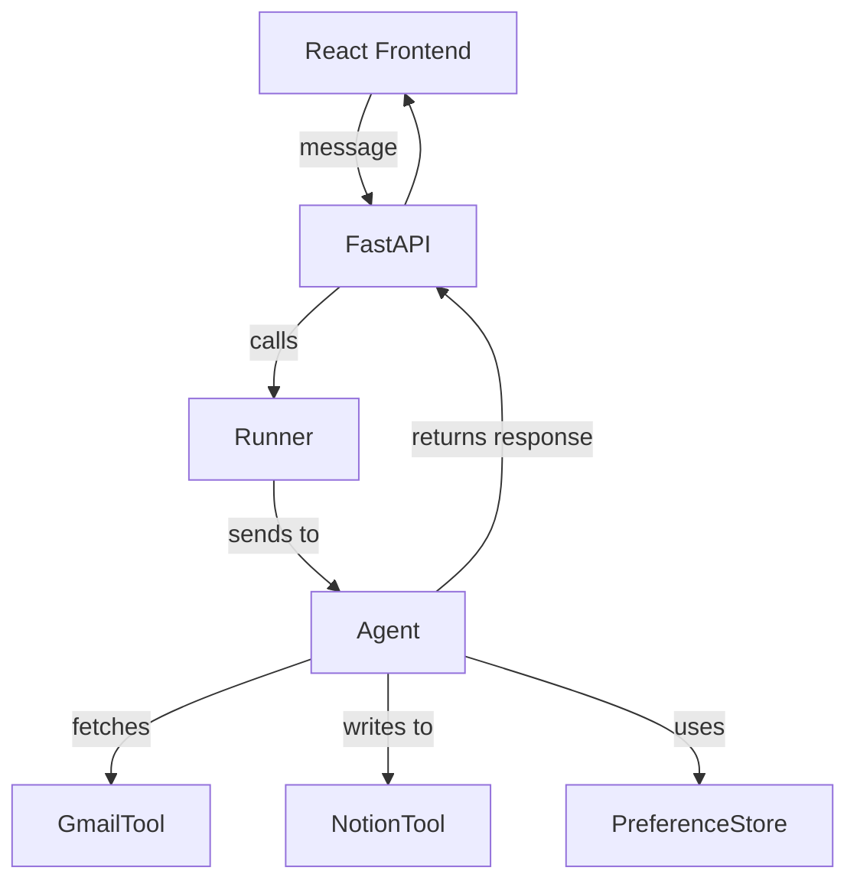

# 🧹 Digital Declutter Assistant

A smart email assistant that helps you triage, clean, and manage your inbox effortlessly. Built using Google ADK, Gemini LLM, custom tools, and a modern web UI, it fetches recent emails, categorizes them intelligently, and helps you take actions with confidence.

---

## 🚀 Features

* 📬 Fetch recent emails from Gmail
* 🧠 Classify emails into: Important / FYI / Spam
* ✅ User confirms before actions (Delete / Archive / Create Task)
* 🔁 Remembers user preferences per sender ("Always delete from X")
* ✅ Notion integration to create todo tasks for important emails
* 💬 Chat-style user interface built with React + FastAPI backend

---

## 🔄 User Journey

1. **User opens the app** and sees a chat interface
2. **User types a command**, e.g. "Get my emails from the last 3 days"
3. **Agent fetches and categorizes emails** using Gmail tool
4. **Agent presents a clear summary**, sorted by importance
5. **User confirms or modifies the action plan**
6. **Agent executes actions**:

   * Deletes spam (if confirmed)
   * Archives read messages
   * Creates Notion tasks for important ones
7. **User sets preferences**, e.g. "Always archive ByteByteGo emails"
8. Agent learns and applies rules automatically in the future

---

## 🧠 System Logic Overview



* Agent is created using `LlmAgent`
* Gemini 1.5 Flash used as model
* Tools registered: `fetch_inbox_emails`, `delete_emails_batch`, `archive_emails_batch`, `create_todo_task`, `get_user_rules`, `save_user_rule`
* Preferences stored in local JSON file to simulate memory

---

## 🧭 Agent Execution Flow Type

This agent follows a **sequential flow with conditional loops**:


This pattern shows interactive and iterative loop-back within a single agent run. It's not a `LoopAgent` or `LongRunningAgent`, but it mimics that behavior through prompt planning and re-invocation.

---

## 📁 Project Structure

```
gmail_declutter/
├── backend/
│   ├── server.py                # FastAPI backend with ADK runner
│   ├── agent/
│   │   ├── __init__.py
│   │   ├── agent.py             # Agent + tools setup
│   │   ├── tools/
│   │   │   ├── gmail_tool.py    # Gmail access logic
│   │   │   └── notion_tool.py   # Notion task creation
│   │   └── preferences.py       # User rule storage
│   └── credentials/             # Token and auth files (ignored in repo)
├── frontend/
│   ├── index.html
│   ├── package.json
│   ├── src/
│   │   ├── App.tsx              # Main chat interface
│   │   ├── api.ts               # Axios client for backend
│   │   ├── components/
│   │   └── types.ts
```

---

## 🛠 Setup Instructions

### Backend (Python)

1. Create a virtual environment:

   ```bash
   python -m venv venv && source venv/bin/activate
   ```
2. Install dependencies:

   ```bash
   pip install -r requirements.txt
   ```
3. Setup Gmail API credentials (OAuth flow via `gmail_tool.py`)
4. Start backend server:

   ```bash
   uvicorn server:app --reload
   ```

### Frontend (React + Vite)

1. Navigate to `frontend/`:

   ```bash
   cd frontend
   ```
2. Install dependencies:

   ```bash
   npm install
   ```
3. Start development server:

   ```bash
   npm run dev
   ```

---

## ✅ Capstone Evaluation Summary

| Capstone Criterion         | Status | Notes                                                 |
| -------------------------- | ------ | ----------------------------------------------------- |
| Agent with tools & memory  | ✅      | Agent uses 6 tools, including preference memory       |
| Custom frontend/backend    | ✅      | Chat-based UI + FastAPI server                        |
| End-to-end task loop       | ✅      | From inbox to task cleanup via user confirmation      |
| Planning + decision making | ✅      | Agent proposes actions and adapts based on user input |
| Preference saving & recall | ✅      | Remembers user sender rules                           |
| Use of Gemini LLM          | ✅      | Via `google.adk.models.google_llm`                    |

---

## 📌 Future Improvements

* Add login/multi-user session support
* Integrate a database instead of local file storage
* Add more context-aware memory via ADK sessions
* Enhance email body parsing and summarization

---

## 🙌 Credits

* Built as a capstone for the Google ADK course
* Powered by Gemini + ADK + Gmail + Notion APIs

---

> Ready to declutter your inbox li
