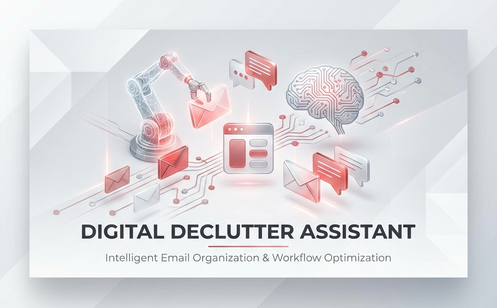
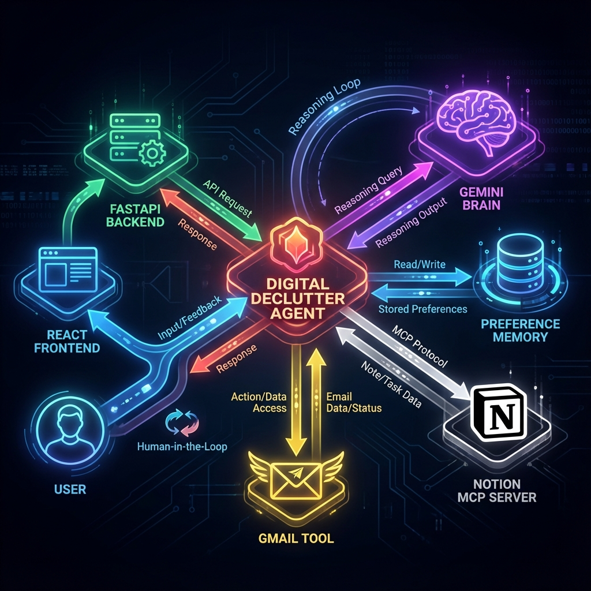
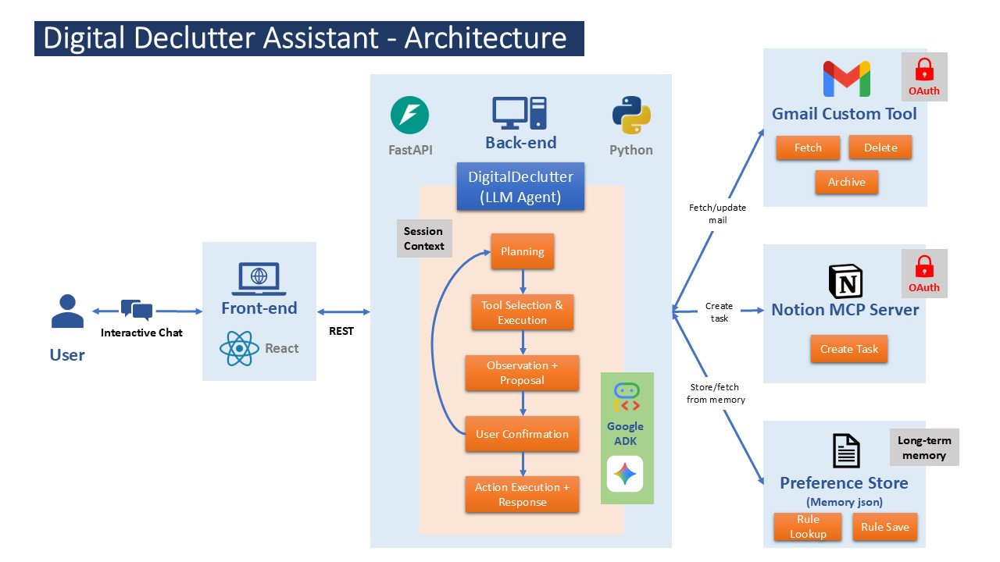
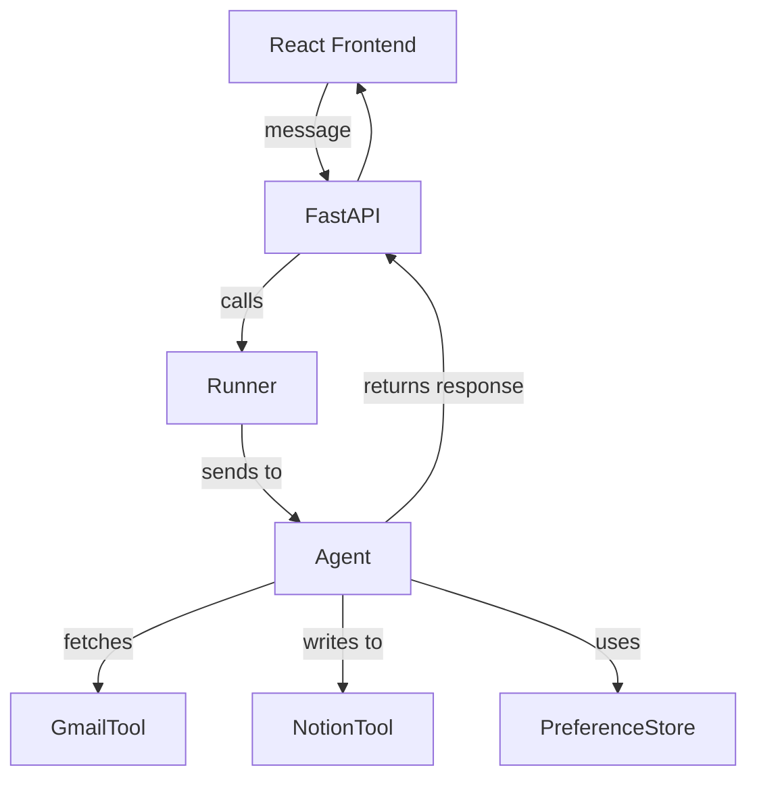
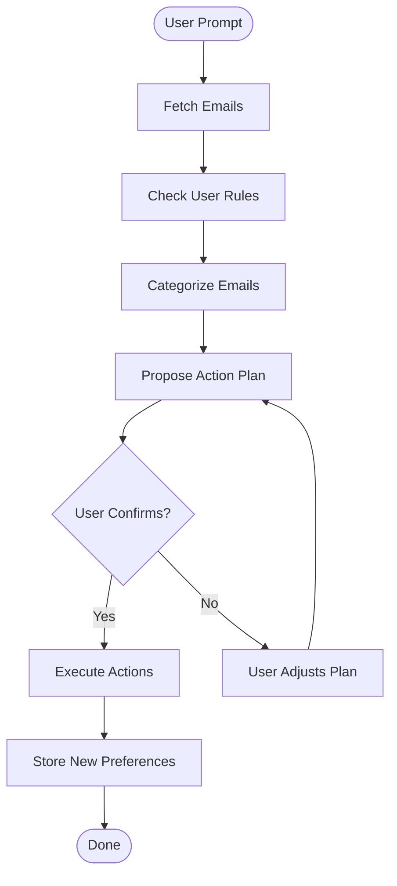

# 🧹 Digital Declutter Assistant




A smart email assistant that helps you triage, clean, and manage your inbox effortlessly. Built using Google ADK, Gemini LLM, custom tools, and a modern web UI, it fetches recent emails, categorizes them intelligently, and helps you take actions with confidence.

---

## 📌 Problem Statement

In the modern digital age, email overload has become a major productivity barrier. Important emails get lost in the clutter, promotions pile up, and task-related emails are forgotten. Manual triage is time-consuming and mentally draining. Users need a proactive, intelligent system that helps them:

* Stay on top of important communications
* Quickly take actions like delete/archive without manual effort
* Create tasks from actionable emails
* Remember user preferences for recurring senders

---

## 💡 Project Proposal



**Digital Declutter Assistant** is a capstone project designed to showcase a multi-tool conversational agent built using Google ADK. It reads a user's Gmail inbox, categorizes emails, seeks user input, and acts accordingly. It stores user preferences (like "always delete emails from X") to personalize future actions. With a React-based chat UI and FastAPI backend, it ensures a seamless experience.

Key Goals:

* Automate email triage and reduce mental overhead
* Create Notion tasks from important emails
* Provide a human-in-the-loop for safety and trust
* Leverage agent memory and preferences to improve over time

---

## 🚀 Features

* 📬 Fetch recent emails from Gmail
* 🧠 Classify emails into: Important / FYI / Spam
* ✅ User confirms before actions (Delete / Archive / Create Task)
* 🔁 Remembers user preferences per sender ("Always delete from X")
* ✅ Notion integration to create todo tasks for important emails
* 💬 Chat-style user interface built with React + FastAPI backend

---


## 🏗️ Architecture



The application follows a modern **Client-Server** architecture:

1.  **Frontend**:
    *   **React + Vite**: A fast, responsive Single Page Application (SPA).
    *   **Tailwind CSS**: Styled to mimic the clean, familiar aesthetic of Gmail.
    *   **Chat Interface**: Real-time interaction with the agent.

2.  **Backend**:
    *   **FastAPI (Python)**: Hosts the Agent and exposes a REST API (`/chat`).
    *   **Google ADK**: Manages the agent's lifecycle, session state, and tool execution.
    *   **Lazy Initialization**: Optimized startup to handle MCP server connections robustly.

3.  **Integrations**:
    *   **Gmail API**: Direct integration via Google Client Library.
    *   **Notion API**: Integrated via a custom **Python MCP Server** (`mcp_server_notion.py`).

---

## 🔄 User Journey

1. **User opens the app** and sees a chat interface
2. **User types a command**, e.g. "Get my emails from the last 3 days"
3. **Agent fetches and categorizes emails** using Gmail tool
4. **Agent presents a clear summary**, sorted by importance
5. **User confirms or modifies the action plan**
6. **Agent executes actions**:

   * Deletes spam (if confirmed)
   * Archives read messages
   * Creates Notion tasks for important ones
7. **User sets preferences**, e.g. "Always archive ByteByteGo emails"
8. Agent learns and applies rules automatically in the future

---

## 🧠 System Logic Overview



* Agent is created using `LlmAgent`
* Gemini 1.5 Flash used as model
* Tools registered: `fetch_inbox_emails`, `delete_emails_batch`, `archive_emails_batch`, `create_todo_task`, `get_user_rules`, `save_user_rule`
* Preferences stored in local JSON file to simulate memory

---

## 🧭 Agent Execution Flow Type

This agent follows a **sequential flow with conditional loops**:



This pattern shows interactive and iterative loop-back within a single agent run. It's not a `LoopAgent` or `LongRunningAgent`, but it mimics that behavior through prompt planning and re-invocation.

---

## 📁 Project Structure

```
gmail_declutter/
├── backend/
│   ├── server.py                # FastAPI backend with ADK runner
│   ├── agent/
│   │   ├── __init__.py
│   │   ├── agent.py             # Agent + tools setup
│   │   ├── tools/
│   │   │   ├── gmail_tool.py    # Gmail access logic
│   │   │   └── notion_tool.py   # Notion task creation
│   │   └── preferences.py       # User rule storage
│   └── credentials/             # Token and auth files (ignored in repo)
├── frontend/
│   ├── index.html
│   ├── package.json
│   ├── src/
│   │   ├── App.tsx              # Main chat interface
│   │   ├── api.ts               # Axios client for backend
│   │   ├── components/
│   │   └── types.ts
```

---

## 🚀 Setup Guide

Since this project handles sensitive data (emails, tasks), all credentials are **gitignored**. Follow these steps to set up your local environment.

### Prerequisites
*   Python 3.10+
*   Node.js & npm
*   Google Cloud Project with **Gmail API** enabled.
*   Notion Integration Token.

### 1. Clone the Repository
```bash
git clone https://github.com/ayush2599/Digital-Declutter-Assistant.git
cd Digital-Declutter-Assistant
```

### 2. Backend Configuration
Create a `.env` file in the root directory:
```env
GOOGLE_API_KEY=your_gemini_api_key
NOTION_API_KEY=your_notion_integration_token
NOTION_DATABASE_ID=your_notion_database_id
```

**Gmail Credentials:**
1.  Download your OAuth 2.0 Client ID JSON from Google Cloud Console.
2.  Save it as `digital_declutter/credentials.json`.
3.  *Note: On first run, the app will open a browser to authenticate you and generate `digital_declutter/token.json`.*

### 3. Install Dependencies

**Backend:**
```bash
pip install -r digital_declutter/requirements.txt
```

**Frontend:**
```bash
cd frontend
npm install
```

### 4. Run the Application

**Step 1: Start the Backend**
Open a terminal in the root directory:
```bash
python backend/server.py
```
*Wait for the server to start on `http://127.0.0.1:8000`.*

**Step 2: Start the Frontend**
Open a new terminal in the `frontend` directory:
```bash
npm run dev
```
*The app will open at `http://localhost:5173`.*

---

## 🎮 How to Use

1.  **Fetch Emails**:
    > "Fetch my emails from the last 3 days."
    > "Show me unread emails from 'Zerodha'."

2.  **Create Tasks**:
    > "Create a task in Notion for the email about the project deadline."
    > "Add a task 'Buy Groceries' with description 'Milk, Eggs, Bread'."

3.  **Manage Rules**:
    > "Emails from 'HR' are always important."
    > "Archive all newsletters from 'Marketing'."

---

## ✅ Capstone Evaluation Summary

| Capstone Criterion         | Status | Notes                                                 |
| -------------------------- | ------ | ----------------------------------------------------- |
| Agent with tools & memory  | ✅      | Agent uses 6 tools, including preference memory       |
| Custom frontend/backend    | ✅      | Chat-based UI + FastAPI server                        |
| End-to-end task loop       | ✅      | From inbox to task cleanup via user confirmation      |
| Planning + decision making | ✅      | Agent proposes actions and adapts based on user input |
| Preference saving & recall | ✅      | Remembers user sender rules                           |
| Use of Gemini LLM          | ✅      | Via `google.adk.models.google_llm`                    |

---

## 📌 Future Improvements

* Add login/multi-user session support
* Integrate a database instead of local file storage
* Add more context-aware memory via ADK sessions
* Enhance email body parsing and summarization

---

## 🙌 Credits

* Built with ❤️ by Ayush as part of learning for the Google x Kaggle Agent Intensive Course
* Powered by Gemini + ADK + Gmail + Notion APIs

---

> Ready to declutter your inbox li
